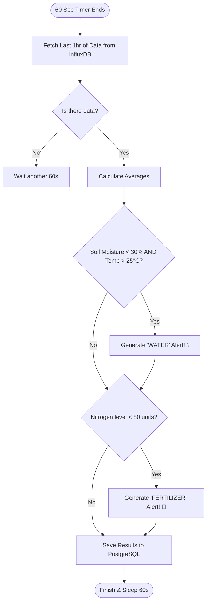

# Understanding the "AI Brain": How Decisions are Made

Think of the `ml_worker` (the AI) as a 24/7 digital farm manager who never sleeps. It follows a loop of **Observe → Reason → Act**.

## 1. Decision Flow Chart
Here is a simplified flowchart of exactly what happens inside the `ml_worker.py` code every 60 seconds:

## 2. The Logic in Plain English

### The "Drought" Logic (Irrigation)
The AI doesn't just look at one number; it looks for a **dangerous combination**.
- **The Rule**: If the soil moisture is **below 30%** AND the air temperature is **above 25°C**, the AI knows the crop is in danger of wilting.
- **The Calculation**: It calculates exactly how much water to add based on how far below the 30% mark the soil has dropped. 
- *Why this is AI*: This is called a "Heuristic" or "Expert System." It simulates a human expert's knowledge in code.

### The "Nutrition" Logic (Fertilizer)
- **The Rule**: If the Nitrogen level (the "N" in NPK) drops **below 80**, the soil is becoming depleted.
- **The Action**: It triggers a fertilizer recommendation to restore the Nitrogen to the optimal level (100).

## 3. How this Evolves into "Advanced" Machine Learning
Right now, the system uses **Hard Rules** (If this, then that). As you collect more data in your InfluxDB database over several weeks, you can replace these simple rules with **Predictive AI** (like a Random Forest model):

1. **Prediction**: Instead of saying "Water now," the AI will say "I predict the soil will be critically dry in **6 hours** based on the current wind and heat."
2. **Optimization**: It will check the **Weather API** (future forecast). If there is 100% chance of rain in 2 hours, it will **cancel** the watering alert to save you money and water!

**You can think of what you have right now as the "Foundational Reasoning" that every smart farm needs!**
