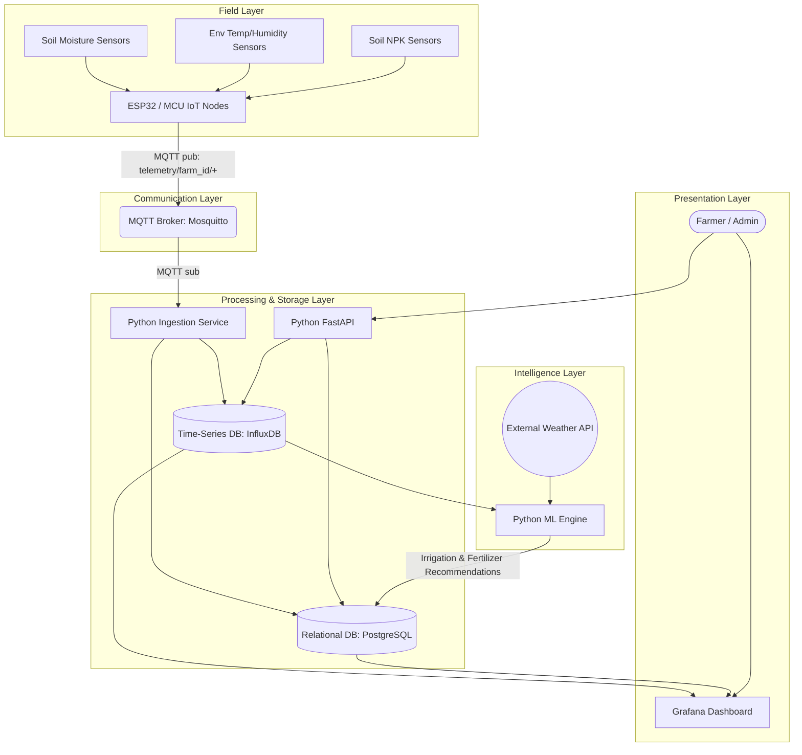

# Precision Farming System: MVP Architecture & Implementation Roadmap

## 1. System Architecture Diagram

The architecture is designed to be modular, separating data acquisition (Edge), message routing (Communication), storage/processing (Backend/Data), intelligence (ML), and visualization (Dashboard).



## 2. Component Breakdown

*   **IoT Layer (Edge)**: ESP32 microcontrollers are recommended due to low cost, built-in Wi-Fi/Bluetooth, and robust deep-sleep capabilities. Attached sensors include Capacitive Soil Moisture sensors, DHT22 (temperature/humidity), and generic NPK sensors via RS485 to TTL converters.
*   **Communication Layer**: Eclipse Mosquitto serves as the MQTT broker handling high-throughput, lightweight messaging from the farm nodes.
*   **Backend Layer**: A Python backend (using FastAPI for performance and async capabilities) handles device management, APIs, and data ingestion logic. A background worker (using `paho-mqtt`) subscribes to the broker and routes ingested data to databases.
*   **Data Layer**: 
    *   *InfluxDB*: Optimized for time-series sensor data, high write speeds, and easy Grafana integration.
    *   *PostgreSQL*: Stores relational entities (users, farms, device metadata, ML recommendations).
*   **Machine Learning Layer**: Python microservice utilizing `scikit-learn` for predictive modeling to determine the precise volume of water and fertilizer required.
*   **Dashboard Layer**: Grafana connects to both InfluxDB and PostgreSQL to visualize farm health and actionable recommendations.

## 3. Data Flow Explanation

1.  **Data Acquisition**: Every 15-30 minutes, the ESP32 wakes from deep sleep, reads soil moisture, NPK levels, and environmental conditions.
2.  **Transmission**: The node publishes a JSON payload to the MQTT broker under the topic `telemetry/<farm_id>/<node_id>/sensors`.
3.  **Ingestion & Routing**: The Python Ingestion Service receives the payload, validates structural integrity, maps it to the specific farm zone, and pushes to InfluxDB.
4.  **Intelligence Generation**: Periodically (e.g., hourly), the ML Engine queries the last 24-72 hours of data from InfluxDB, pulls incoming precipitation forecasts via an external Weather API, and infers future soil moisture depletion.
5.  **Recommendation Serving**: The prediction triggers a recommendation (e.g., "Apply 5mm irrigation in Zone A") saved to PostgreSQL.
6.  **Visualization**: The farmer observes current live values via Grafana, alongside a dedicated panel showing the generated recommendations originating from PostgreSQL.

## 4. Machine Learning Approach

*   **Models**: 
    1.  *Soil Moisture Prediction Model*: A **Random Forest Regressor** or **XGBoost**. They handle non-linear relationships well without the immense data requirements of deep learning.
    2.  *Fertilizer Optimization Model*: A classification or rule-based expert system mapping current NPK offsets against known crop requirement baselines.
*   **Inputs (Features)**: 
    *   Current soil moisture levels (%).
    *   Local weather data (Temp, Humidity).
    *   Forecasted rainfall (mm) for the next 24 hours.
    *   Evapotranspiration rate (ET) approximations.
    *   Crop type and current growth stage (metadata from Postgres).
*   **Outputs (Targets)**: 
    *   Predicted soil moisture 24h into the future.
    *   Binary decision: Irrigation Needed (Yes/No).
    *   Volume of water recommended per zone.
*   **Training Strategy**: For the MVP, train an initial base model using open-source agricultural datasets (e.g., Kaggle Crop Recommendation/Moisture datasets) mapped to similar agro-climatic zones. Implement an automated monthly re-training pipeline that uses the farm’s own historical data from InfluxDB to iteratively improve local accuracy.

## 5. API Design

The backend uses RESTful architecture via FastAPI.

| Endpoint | Method | Purpose |
| :--- | :--- | :--- |
| `/api/v1/devices` | `POST` | Register a new IoT sensor node to a farm. |
| `/api/v1/devices/{id}/status` | `GET` | Retrieve the latest heartbeat/battery status of a node. |
| `/api/v1/farms/{id}/zones` | `GET` | List all irrigation zones in a farm. |
| `/api/v1/recommendations/zones/{id}` | `GET` | Fetch the latest ML irrigation/fertilizer recommendations. |
| `/api/v1/actuators/irrigation` | `POST` | (Future integration) Trigger a manual water valve override. |

## 6. Database Design

### Time-Series (InfluxDB)
Bucket: `farm_telemetry`
*   **Measurements**: `sensor_readings`
*   **Tags** (Indexed for fast query): `farm_id`, `zone_id`, `device_id`
*   **Fields**: `soil_moisture`, `temperature`, `humidity`, `nitrogen`, `phosphorus`, `potassium`, `battery_voltage`.

### Relational (PostgreSQL)
*   `users`: `id`, `email`, `password_hash`, `role`
*   `farms`: `id`, `owner_id`, `name`, `latitude`, `longitude`, `crop_type`
*   `devices`: `id`, `farm_id`, `zone_id`, `mac_address`, `activation_date`
*   `recommendations`: `id`, `zone_id`, `type` (WATER/FERTILIZER), `suggested_amount`, `reasoning_metrics`, `created_at`, `status` (PENDING/APPLIED/REJECTED)

## 7. MQTT Communication Workflow

*   **QoS Strategy**: Quality of Service (QoS) 1 (At least once) ensuring no data loss if the ingestor drops momentarily. 
*   **Payload formatting**: 
    ```json
    {
      "timestamp": 1698243600,
      "battery": 3.7,
      "sensors": {
          "sm": 45.2,
          "temp": 24.1,
          "hum": 60.5,
          "n": 120, "p": 45, "k": 180
      }
    }
    ```
*   **Topic Tree**: 
    *   `telemetry/{farm_id}/{zone_id}/{device_id}` (For Data)
    *   `status/{farm_id}/{device_id}` (For LWT - Last Will and Testament to detect offline nodes)

## 8. Dashboard Design (Grafana)

1.  **Farm Overview**: Heatmap of current soil moisture across all zones to quickly identify dry patches.
2.  **Live Environment Metics**: Real-time line charts showing Temperature, Humidity, and Moisture overlaid against minimum/maximum thresholds.
3.  **Soil Nutrients (NPK)**: Bar gauges showing current N, P, K levels compared against optimal ranges for the configured crop type.
4.  **AI Insights Engine**: A stylized table panel fetching from PostgreSQL showing actionable recommendations (e.g., *Zone B: Apply 50L Nitrogen Mix; High moisture depletion expected tomorrow.*)

## 9. Deployment Plan

*   **MVP / Local Hybrid**: For farms with poor internet connectivity, run a Raspberry Pi 4 as a local edge server. Run Docker Compose locally containing Mosquitto, InfluxDB, Postgres, and the Python backend. The local server syncs recommendations to a cloud dashboard periodically.
*   **Production Cloud (e.g., AWS)**:
    1.  Provision an EC2 instance / ECS Cluster to run backend Python containers.
    2.  Provision managed PostgreSQL (AWS RDS).
    3.  Deploy Mosquitto on a dedicated lightweight EC2 instance or utilize AWS IoT Core.
    4.  Deploy InfluxDB in a high-io Volume container.
    5.  Host Grafana via Grafana Cloud mapping to the EC2 exposed data sources.

## 10. Scalability & Optimization Strategy

*   **Data Volume**: InfluxDB natively handles downsampling. Configure retention policies to keep raw per-minute data for 30 days, and downsample to hourly averages for long-term storage and ML use.
*   **Broker Scaling**: As nodes exceed 10,000+, transition from Eclipse Mosquitto to a clustered MQTT broker like EMQX.
*   **Stateless Backend**: The FastAPI backend contains no session state, allowing it to scale horizontally behind a load balancer as API traffic increases.

## 11. Security and Risk Considerations

*   **Device Authentication**: Devices connect to MQTT using TLSv1.2 with individual X.509 client certificates or strong JWT tokens. No anonymous MQTT connections.
*   **API Security**: All endpoints require JWT Bearer authentication.
*   **Physical Hardware Risk**: Environmental degradation. *Mitigation:* Use IP67-rated weatherproof enclosures and conformal coating for PCBs.
*   **Network Loss**: *Mitigation:* Edge devices log readings to local SD or flash memory if Wi-Fi/LoRa drops, and bulk-publish data upon reconnection.

## 12. Development Roadmap

*   **Phase 1: Hardware & Infrastructure (Weeks 1-2)**
    *   Assemble ESP32 sensor nodes.
    *   Set up Dockerized MQTT broker, InfluxDB, and PostgreSQL.
    *   Establish stable telemetry publishing from device to DB.
*   **Phase 2: Backend Development (Weeks 3-4)**
    *   Develop FastAPI device management endpoints.
    *   Create MQTT ingestion worker.
    *   Define PostgreSQL schemas using ORM (SQLAlchemy).
*   **Phase 3: Visualization (Week 5)**
    *   Deploy Grafana.
    *   Build the comprehensive Farm Overview and Live Metrics dashboards.
*   **Phase 4: Machine Learning Integration (Weeks 6-7)**
    *   Develop and train MVP Random Forest models offline.
    *   Deploy the Python ML service.
    *   Integrate Weather API.
    *   Write recommendations to DB and visualize in Grafana.
*   **Phase 5: Field Testing & Release (Week 8)**
    *   Deploy nodes on physical soil.
    *   Validate sensor accuracy and system uptime.
    *   Tune ML thresholds based on real-world observations.
    *   Finalise MVP deployment.
